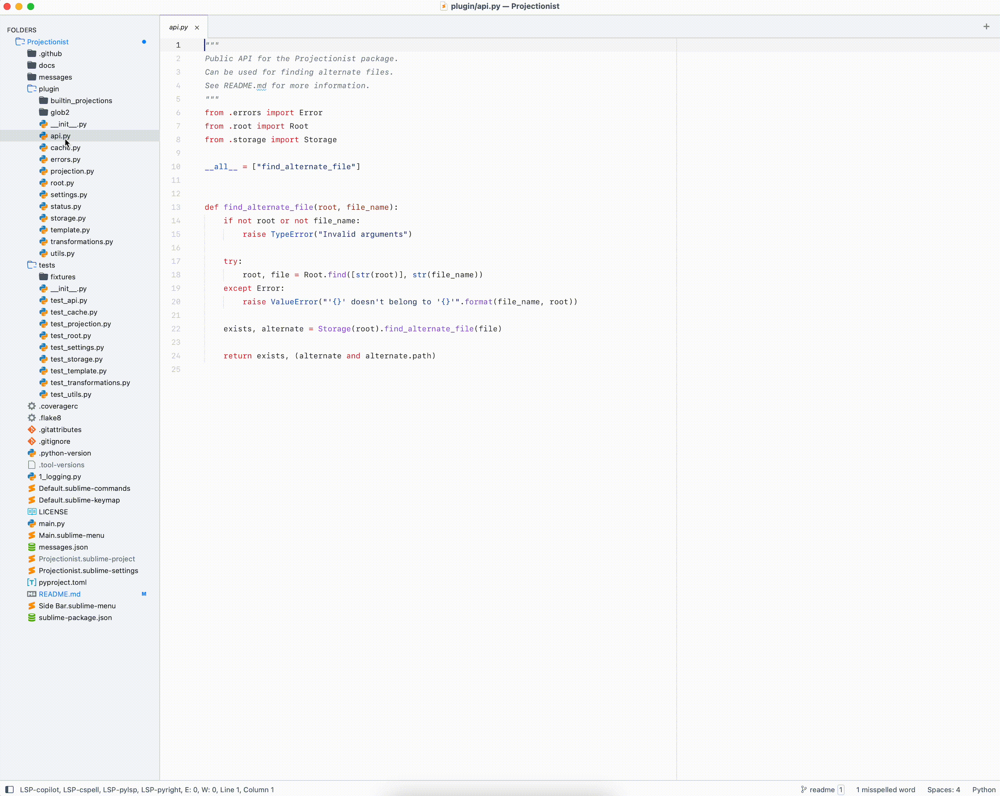

<!-- markdownlint-disable -->
[](https://stand-with-ukraine.pp.ua)

# Projectionist [](https://github.com/timfjord/Projectionist/actions/workflows/lint.yml) [](https://github.com/timfjord/Projectionist/actions/workflows/test.yml)
<!-- markdownlint-enable -->
Go to an alternate file and more.

## Features

- jump between test and implementation files
- open/jump to an alternate file from the SideBar
- `.projections.json` file support (including JSON schema validation)
- built-in projections for Elixir, Ruby, and Sublime package development
- work on all platforms

## Installation

1. Install the [Sublime Text Package Control](https://packagecontrol.io/) package if you don't have it already.
2. Open the command palette and start typing `Package Control: Install Package`.
3. Enter `Projectionist`.

## Usage

The package implements the logic that was originally introduced by [Tim Pope](https://github.com/tpope) in his [vim-projectionist](https://github.com/tpope/vim-projectionist) plugin. 
And the main idea is to:

> provide granular project configuration using "projections".

### What are projections?

Projections are maps from file names and globs to sets of properties describing the file.
The simplest way to define them is to create a `.projections.json` in the root of the project, 
but there are other ways to define projection too (see [Sublime Text integration section](#sublime-text-integration)).  
The package ships with a JSON schema for the `.projections.json` file to provide validation and auto-completion (requires [LSP-json](https://github.com/sublimelsp/LSP-json) package).

Here's a simple example for a Maven project:

```json
{
  "src/main/java/*.java": {
    "alternate": "src/test/java/{}.java",
  },
  "src/test/java/*.java": {
    "alternate": "src/main/java/{}.java",
  }
}
```

In property values, `{}` will be replaced by the portion of the glob matched by the `*`.
You can also chain one or more transformations inside the braces separated by bars, e.g. `{dot|hyphenate}`.
The complete list of available transformations is as follows:

|         Name | Behavior                                                       |
|-------------:|:---------------------------------------------------------------|
|        `dot` | `/` to `.`                                                     |
| `underscore` | `/` to `_`                                                     |
|  `backslash` | `/` to `\`                                                     |
|     `colons` | `/` to `::`                                                    |
|  `hyphenate` | `_` to `-`                                                     |
|      `blank` | `_` and `-` to space                                           |
|  `uppercase` | uppercase                                                      |
|  `camelcase` | `foo_bar/baz_quux` to `fooBar/bazQuux`                         |
|  `snakecase` | `FooBar/bazQuux` to `foo_bar/baz_quux`                         |
| `capitalize` | capitalize first letter and each letter after a slash          |
|    `dirname` | remove last slash separated component                          |
|   `basename` | remove all but last slash separated component                  |
|   `singular` | singularize                                                    |
|     `plural` | pluralize                                                      |
|       `file` | absolute path to file                                          |
|    `project` | absolute path to project                                       |
|       `open` | literal `{`                                                    |
|      `close` | literal `}`                                                    |
|    `nothing` | empty string                                                   |
|        `vim` | no-op (include to specify other implementations should ignore) |

From a globbing perspective, `*` is actually a stand in for `**/*`.
For advanced cases, you can include both globs explicitly: `test/**/test_*.rb`.
When expanding with `{}`, the `**` and `*` portions are joined with a slash.
If necessary, the dirname and basename expansions can be used to split the value back apart.

As of now, the package supports only some of the properties from the original implementation, 
but support to more properties will be added in the future.
Here are the properties that are currently supported:

- `alternate`  
Determines the destination of the `projectionist_open_alternate` command.  
If this is a list, the first readable file will be used.  Will also be used as a default for `related`.

- `template`  
Array of lines to use when creating a new file.

These are the properties that are not supported yet:

- `console`  
Command to run to start a REPL or other interactive shell.  
This is useful to set from a `*` projection or on a simple file glob like `*.js`.  
Will also be used as a default for `start`.  
Expansions are shell escaped.

- `dispatch`  
Expansions are shell escaped.

- `make`  
Sets `makeprg`.  
This is useful to set from a `*` projection.  
Expansions are shell escaped.

- `path`  
Additional directories to prepend to `path`.  
Can be relative to the project root or absolute.  
This is useful to set on a simple file glob like `*.js`.

- `related`  
Indicates one or more files to search when a navigation command is called without an argument, to find a default destination.  
Related files are searched recursively.

- `start`  
Command to run to "boot" the project.  
Examples include `lein run`, `rails server`, and `foreman start`.  
This is useful to set from a `*` projection.  
Expansions are shell escaped.

- `type`  
Declares the type of file and creates a set of navigation commands for opening files that match the glob.

### Sublime Text integration

The package supports projections from the following sources:

- `local` - projections defined in the project config file (e.g. `MyProject.sublime-project`)
- `file` - projections defined in the `.projections.json` file
- `global` - heuristic projections defined in the global settings 
- `builtin` - built-in heuristic projections that ship with the package

The lookup order is determined by the `lookup_order` setting and it is:

```jsonc
{
  "lookup_order": [
    "local", // first look in the project settings
    "file", // then, in the .projections.json file
    "global", // then, the `heuristic_projections` from the package settings
    "builtin" // and finally, he built-in heuristic projections
  ]
}
```

To avoid evaluation projections from some of the sources, remove them from the `lookup_order` setting:

```jsonc
{
  "lookup_order": ["local", "file"] // evaluate only local and .projections.json projections
}
```

The order of the items in the `lookup_order` setting is important, so switching items in the array will change the lookup order:

```jsonc
{
  "lookup_order": [
    "file", // first look in the .projections.json file
    "local", // then, in the project settings
    "builtin", // then, the built-in heuristic projections
    "global" // and finally, the `heuristic_projections` from the package settings
  ]
}
```

Given the number of projection sources, the package provides the `projectionist_output_projections` command
(or `Projectionist: Output projections` in the Command Palette)
to output all the projections to the Sublime Text console.

The `lookup_order` also determines how projections with the same pattern are handled.
So, for example, if the same pattern is defined in multiple sources, 
the properties will be merged obeying the order defined in the `lookup_order` setting.  
So, for example, if there is a local projection:

```
{
  "lib/*.ex": {
    "alternate": "test/{}_test.exs",
    "prop2": "value2"
  }
}
```

and a built-in projection:

```
{
  "lib/*.ex": {
    "alternate": "spec/{}_spec.exs",
    "prop1": "value1"
  }
}
```

the resulting projection will be:

```
{
  "lib/*.ex": {
    "alternate": "test/{}_test.exs",
    "prop1": "value1",
    "prop2": "value2"
  }
}
```

And to avoid overriding projection defined on deeper levels, the `append`/`prepend` prefix can be used, for example:

```
{
  "lib/*.ex": {
    "prepend_alternate": "spec/{}_spec.exs",
    "prop1": "value1"
  }
}
```

will result in:

```
{
  "lib/*.ex": {
    "alternate": [
      "spec/{}_spec.exs",
      "test/{}_test.exs"
    ],
    "prop1": "value1",
    "prop2": "value2"
  }
}
```

This can be very useful to, say, fine-tune projections defined in the `.projections.json` file
since this file can be used by other editors (e.g. VIM, VSCode).

As of now, only the `alternate` property supports these prefixes.

#### Local projections

Local projections can be defined in the project settings:

```json
{
  "folders": [
    {
      "path": ".",
    }
  ],
  "settings": {
    "Projectionist": {
      "projections": {
        "plugin/*.py": {
          "alternate": "tests/{dirname}/test_{basename}.py",
        },
        "tests/**/test_*.py": {
          "alternate": "plugin/{}.py",
        }
      }
    }
  }
}
```

#### Heuristic projections

Heuristic projections can be defined through the variable `heuristic_projections` in the global setting and they behave as a dictionary mapping between a string describing the root of the project and a set of projections.
The keys of the dictionary are files and directories that can be found in the root of a project, with `&` separating multiple requirements and `|` separating multiple alternatives.  
You can also prefix a file or directory with `!` to forbid rather than require its presence.

In the example below, the first key requires a file named `mix.exs` and a file named `test/test_helper.exs`.
```json
{
  "heuristic_projections": {
    "mix.exs&test/test_helper.exs": {
      "lib/*.ex": {
        "alternate": "test/{}_test.exs",
        "template": [
          "defmodule {camelcase|capitalize|dot} do",
          "end"
        ]
      },
      "test/*_test.exs": {
        "alternate": "lib/{}.ex",
        "template": [
          "defmodule {camelcase|capitalize|dot}Test do",
          "  use ExUnit.Case",
          "",
          "  alias {camelcase|capitalize|dot}",
          "end",
        ]
      }
    }
  }
}
```

#### Built-in projections

The package comes with the following list of built-in projections and they are enabled by default:

- `elixir` (see https://github.com/timfjord/Projectionist/blob/main/plugin/builtin_projections/elixir.py)
- `ruby` (see https://github.com/timfjord/Projectionist/blob/main/plugin/builtin_projections/ruby.py)
- `sublime` (see https://github.com/timfjord/Projectionist/blob/main/plugin/builtin_projections/sublime.py)

To disable some of the built-in projections, remove them from the `builtin_heuristic_projections` setting:

```jsonc
{
  "builtin_heuristic_projections": ["elixir", "ruby"] // disable the sublime projection
}
```

#### Caching

For performance reasons, heuristic projections (both global and built-in) are determined once per project and then cached.
The same goes for the `.projections.json` file, it is parsed and cached per project.
So it is important to clear the cache after changing heuristic projections or updating the `.projections.json` file.  
The cache can be cleared with the `projectionist_clear_cache` command or via the `Projectionist: Clear Cache` command from the Command Palette.

#### Project folders and subprojects

The package supports multiple project folders. It can be very useful when there is a nested folder
that contains a separate project. The package can detect this situation and use this information
for heuristic projections calculation and detecting the `.projections.json` file.

Another way to handle nested projects is to use the `subprojects` settings (usually in the project config)

```json
{
  "folders": [
    {
      "path": ".",
    }
  ],
  "settings": {
    "Projectionist": {
      "subprojects": [
        "subfolder1/subfolder1_1",
        ["subfolder2", "subfolder2_1"]
      ]
    }
  }
}
```

A subproject can be either a string or an array of strings(the path separator will be added automatically in this case).

## Roadmap

- support more original projectionist features, like `type`, `console`, `dispatch`

## Credits

`Projectionist` is a Sublime Text implementation of the [vim-projectionist](https://github.com/tpope/vim-projectionist) plugin so all credits go to the authors and maintainers of this awesome Vim plugin.

## Demo


